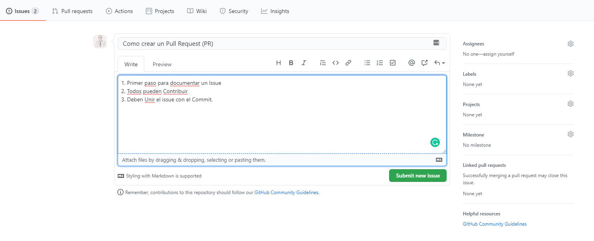

# Setup Stage

## Open Issue

* **Issues** es una forma de documentar muchoo pero mucho mejor que los "emails" o reuniones personales(cuando alguien toma nota)

* **Issues** permiten a todos los miembros del equipo a proveer inputs y formas de solucion a los problemas que enfrentan.  

  

* Cómo creamos un Issue? 

    1. Click en la pestaña **Issue**
    2. Describe la tarea que van a hacer y asignar a la persona encargada. 
    3. Agreguen labels para busquedas futuras. 

## Create a branch

* Esto ya les he enseñado. Pero ahora me gustaría señalar que deberían crear el **branche** con un nombre asociado a la tarea que van a realizar. 

## Open a Pull Request (PR)
Puede parecer contraintuitivo pero deberían abrir un PR antes de que empiecen a trabajar todo. La mayoría de la gente primero termina todas las tareas y recién al final deciden hacer el pull request. 

La version que ustedes **Uniran** al master branch no será la que envías cuando creas el PR sino mas bien la que al final el Repo Mantainer haga **Merge** . 

Sugerencias :
1. Dar un nombre al PR un nombre asociado al nombre del branch, pero un poco más descriptivo. 
2. Pueden agregar un label _**Work in Progres**_. 
3. 

# Work Stage

# Merge Stage 
